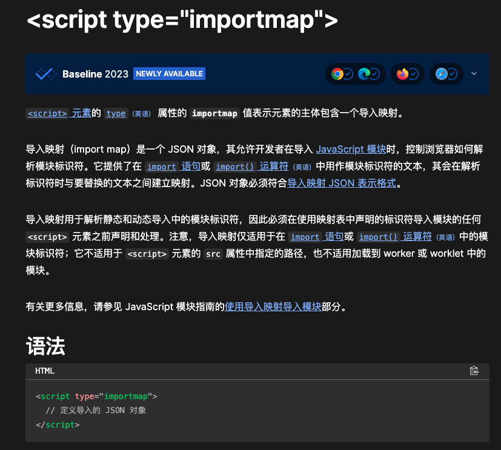
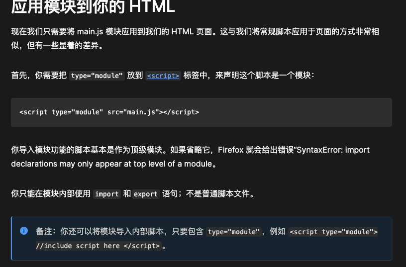
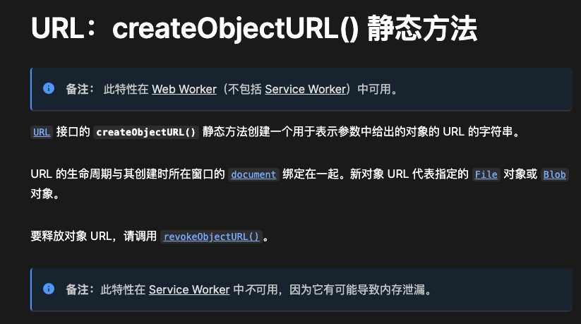

# 实现思路

如何让 React 组件在浏览器中运行？

## 核心技术

### 1. importmap


importmap 是一种在 JavaScript 应用中用于管理模块导入的机制。可以通过 importmap 来指定模块路径的映射关系，通过直接在浏览器中定义模块依赖和解析方式，这样就不需要走依赖打包的逻辑。参考链接：[MDN - importmap](https://developer.mozilla.org/zh-CN/docs/Web/HTML/Element/script/type/importmap)

```js
<script type="importmap">
{
    "imports": { 
        "react": "https://esm.sh/react@18.2.0",
        "react-dom/client": "https://esm.sh/react-dom@18.2.0"
    }
}
</script>

<script type="module">
import React from 'react';
import ReactDOM from 'react-dom/client';
import App from './App';
const root = ReactDOM.createRoot(document.getElementById('root'));
root.render(<App />);
</script>
// 等同于

<script type="module">
import React from 'https://esm.sh/react@18.2.0';
import ReactDOM from 'https://esm.sh/react-dom@18.2.0';
import App from './App';
const root = ReactDOM.createRoot(document.getElementById('root'));
root.render(<App />);
</script>
```

### 2. script module


`<script type="module">` 可以在 HTML 中使用 JavaScript 模块，可以在代码中使用 import 和 export。参考链接：[MDN - JavaScript modules](https://developer.mozilla.org/zh-CN/docs/Web/JavaScript/Guide/Modules#%E5%BA%94%E7%94%A8%E6%A8%A1%E5%9D%97%E5%88%B0%E4%BD%A0%E7%9A%84_html)

### 3. esm.sh
```js
import _ from 'https://esm.sh/lodash';
console.log(_.isEmpty({}));
```
esm.sh 是一个在线服务平台，用于将 Node.js 生态系统中的模块（npm 包）转换为符合浏览器原生 ES Modules (ESM) 格式的模块文件。比较好的地方在于 esm.sh 可以将基于 CommonJS 或 ESModules 格式的 Node.js 包转换为浏览器支持的 ESM 格式。自动处理依赖解析和兼容性问题。参考链接：[esm.sh](https://code.esm.sh/)

## 实现方案

### 1. JSX 转换
jsx 代码是无法在浏览器中直接执行的，需要转换为 javascript 代码才能在浏览器中执行，比如：
```jsx
// jsx
<div>Hello</div>

// javascript
React.createElement("div", null, "Hello");
```

使用 @babel/standalone 在浏览器中转换：
```js
import { transform } from '@babel/standalone';

const babelTransform = (code: string) => {
  return transform(code, {
    presets: ['react'],
  }).code;
};
```

### 2. 文件引用处理


浏览器中不存在文件系统，所以直接用原始代码中的`import App from './App';`是找不到`App`的。所以需要处理存在模块之间的引用，不仅仅是 js 还可能是 json 或者 css。

思路其实就是是否可以像 esm.sh 那样将 ./App 转换为一个在线的链接，实现类似的效果：
```js
import App from './App'
// -->
import App from 'http://xxx/App'
```

这里使用的是 URL.createObjectURL，参考链接：[MDN - URL.createObjectURL](https://developer.mozilla.org/zh-CN/docs/Web/API/URL/createObjectURL)

URL.createObjectURL 是一个 Web API，用于为特定的 Blob 或 File 对象创建一个临时的 URL，通常称为对象 URL。它可以让你在浏览器中直接引用这些对象，而无需通过 HTTP 服务器传递它们。

```js
const objectURL = URL.createObjectURL(blob);
```

css 和 json 处理就转换为 js 引入：
```js
const css = '#root{color:red}'
// 直接插入到 html 中
const js = `
  (() => {
    let stylesheet = document.getElementById('style');
    if (!stylesheet) {
      stylesheet = document.createElement('style')
      stylesheet.setAttribute('id', 'style')
      document.head.appendChild(stylesheet)
    }
    const styles = document.createTextNode(\`${css}\`)
    stylesheet.innerHTML = ''
    stylesheet.appendChild(styles)
  })()
  `
// 转换为临时文件地址 --> blob:http://localhost:3000/e4ef352f-1c5f-414e-8009-33514b300842
const cssUrl = URL.createObjectURL(
  new Blob([js], { type: "application/javascript" })
);
```

## 总结
这样就实现了一个简单的 React 组件在线运行环境，主要解决了以下问题：

1. **模块加载**：通过 importmap 和 esm.sh 解决了 npm 包的加载问题
2. **代码转换**：使用 @babel/standalone 解决了 JSX 的转换问题
3. **文件引用**：通过 URL.createObjectURL 解决了模块间引用的问题

### 技术栈
- React 18.2.0
- @babel/standalone（JSX 转换）
- esm.sh（npm 包加载）
- Web APIs：
  - importmap
  - URL.createObjectURL
  - ES Modules

### 优点
1. 不需要本地环境：直接在浏览器中运行
2. 实时预览：代码修改后可以立即看到效果
3. 轻量级：不需要打包工具
4. 易于分享：可以通过 URL 分享代码

### 不足
1. 性能问题：代码转换在运行时进行会有性能开销
2. 浏览器兼容：需要现代浏览器支持
3. 调试不便：相比本地开发环境调试能力较弱
